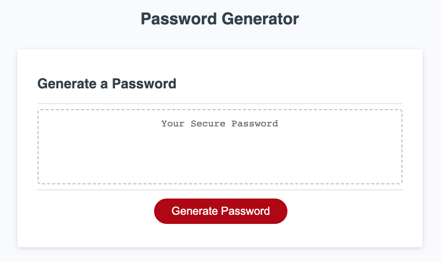

# 03 JavaScript: Password Generator

https://github.com/peterwonghg/Challenge03.git

https://peterwonghg.github.io/Challenge03/

## ReadMe Context
The JavaScript is based conceptually from Daniel Vega’s Random Password Generator in JavaScript with the following tweaks:
1.	Change most of ‘var’ to ‘const’ and ‘let’ as explained in Sam Ngu: Ep1 – Why we shouldn’t use Var in JavaScript | Var vs Let and Const and Scope Explained!
2.	Adding Character type validation

This readme is documented with the following acceptance criteria references and corresponding task or sub task references to achieve the acceptance criteria
AC: Acceptance Criteria
HTML: Hypertext Markup Language
CSS: Cascading Style Sheet
JS: JavaScript

It is aimed at fully documenting the full process and train of thoughts to the completion of this challenge.

## User Story
AS AN employee with access to sensitive data
I WANT to randomly generate a password that meets certain criteria
SO THAT I can create a strong password that provides greater security

## Acceptance Criteria (AC)
GIVEN I need a new, secure password

### AC01

WHEN I click the button to generate a password
THEN I am presented with a series of prompts for password criteria
Task ac01jc01
Create the function getPrompts() to be presented with a series of prompts for the password criteria, this includes Character Length validation

### AC02
WHEN prompted for password criteria
THEN I select which criteria to include in the password
Task ac02jc01 
Create password length prompt presented by a dialogue box with the ability to enter a number between 8-128.  The dialog box consists of a message titled “This page says” and paragraph stating “Enter Character Length Number between 8-128”, a box area to enter the desired number and two buttons marked ‘Ok’ to confirm and ‘Cancel’ to abort.

Task ac02jc02 
Create lowercase inclusion prompt presented by a dialogue box.  The dialog box consists of a message titled “This page says” and paragraph stating “Are Lowercase characters to be included in your password?”, two buttons marked ‘Ok’ to confirm ‘YES’ and ‘Cancel’ to confirm ‘NO’.

Task ac02jc03
Create uppercase inclusion prompt presented by a dialogue box.  The dialog box consists of a message titled “This page says” and paragraph stating “Are Uppercase characters to be included in your password?”, two buttons marked ‘Ok’ to confirm ‘YES’ and ‘Cancel’ to confirm ‘NO’.

Task ac02jc04
Create number inclusion prompt presented by a dialogue box.  The dialog box consists of a message titled “This page says” and paragraph stating “Are Numbers to be included in your password?”, two buttons marked ‘Ok’ to confirm ‘YES’ and ‘Cancel’ to confirm ‘NO’.

Task ac02jc05
Create symbols inclusion prompt presented by a dialogue box.  The dialog box consists of a message titled “This page says” and paragraph stating “Are Symbols to be included in your password?”, two buttons marked ‘Ok’ to confirm ‘YES’ and ‘Cancel’ to confirm ‘NO’.

### AC03
WHEN prompted for the length of the password
THEN I choose a length of at least 8 characters and no more than 128 characters
Task ac03jc01
Dialog box with the message Enter number of password characters between 8-128 and a box to enter character length value with a CANCEL to indicate that 0 entry and try again and OK to proceed to the character type prompts

### AC04
WHEN asked for character types to include in the password
THEN I confirm whether or not to include lowercase, uppercase, numeric, and/or special characters
Task ac02jc02 
Create lowercase inclusion prompt presented by a dialogue box.  The dialog box consists of a message titled “This page says” and paragraph stating “Are Lowercase characters to be included in your password?”, two buttons marked ‘Ok’ to confirm ‘YES’ and ‘Cancel’ to confirm ‘NO’.

Task ac02jc03
Create uppercase inclusion prompt presented by a dialogue box.  The dialog box consists of a message titled “This page says” and paragraph stating “Are Uppercase characters to be included in your password?”, two buttons marked ‘Ok’ to confirm ‘YES’ and ‘Cancel’ to confirm ‘NO’.

Task ac02jc04
Create number inclusion prompt presented by a dialogue box.  The dialog box consists of a message titled “This page says” and paragraph stating “Are Numbers to be included in your password?”, two buttons marked ‘Ok’ to confirm ‘YES’ and ‘Cancel’ to confirm ‘NO’.

Task ac02jc05
Create symbols inclusion prompt presented by a dialogue box.  The dialog box consists of a message titled “This page says” and paragraph stating “Are Symbols to be included in your password?”, two buttons marked ‘Ok’ to confirm ‘YES’ and ‘Cancel’ to confirm ‘NO’.

### AC05
WHEN I answer each prompt
THEN my input should be validated and at least one character type should be selected
Task ac05jc01
Character Length validation had been incorporated to handle NaN, character length less than 8 and character length more than 128.  If any of the conditions are not met, an alert box with the following message will appear “Character length has to be a NUMBER between 8-128, Please Try Again.”

Task ac05jc02
When CANCEL button is selected at Character Length prompt or CANCEL (Exclude) all Character Types, Character Length val;ue will be ‘0’ which will issue an alert “Please Try Again and choose at least ONE Character Type.”  This also serves as validation for at least one character type choice to proceed.

### AC06
WHEN all prompts are answered
THEN a password is generated that matches the selected criteria
Task ac06jc01
A generatePassword function was created using a for loop to generate a random character of the character type.  The random position of the character type string is determined by using the product of Math.random with the total length of the character type array and rounded down to determine the string position.  Math.random generates a random number between 0 and <1, this is then multiplied by the total number of elements in the array to determine a number between 1 and the total number of elements.  This number mark the sequential position of the character type array and that character is chosen and then the next character is randomly picked and the loop continues till the specified password length. 

Note the result is rounded by Math.floor because the first character position is marked with position ‘0’, therefore the final character position will be n-1 with n being the total number of characters (character length) in the array. 

### AC07
WHEN the password is generated
THEN the password is either displayed in an alert or written to the page
Task ac07jc01
An if else statement is added to confirm the validated prompts that enables the generatePassword function.

### References

JavaScript Password Generator: https://www.google.com/search?q=javascript+password+generator&oq=javascript+password+generator&aqs=chrome..69i57j0i512l6j0i22i30l3.7020j0j7&sourceid=chrome&ie=UTF-8#fpstate=ive&vld=cid:4ccfc666,vid:duNmhKgtcsI

https://www.youtube.com/watch?v=v2jfGo7ztm8 Daniel Vega: Random Password Generator in JavaScript

https://www.youtube.com/watch?v=x4HUaiazDes  Paul Keldsen: Homework Startup Guide – Javascript Password Generator

https://www.youtube.com/watch?v=FNh2JCiFXIg Sam Ngu: Ep1 – Why we shouldn’t use Var in JavaScript | Var vs Let and Const and Scope Explained!
